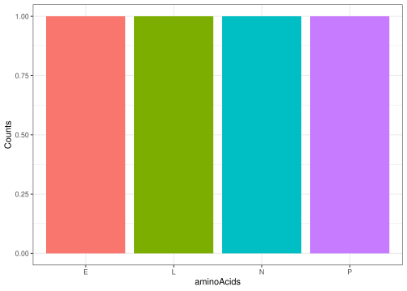

Vignette
================

## OVERVIEW

The group26molbio package provides a collection of functions for
performing basic operations in molecular biology — from DNA/RNA
manipulation to sequence analysis. This vignette introduces each
function and demonstrates how to use them effectively.

## INSTALLATION

``` r
devtools::install_github("rforbiodatascience25/group_26_package")
#> Downloading GitHub repo rforbiodatascience25/group_26_package@HEAD
#> rlang    (1.1.5 -> 1.1.6) [CRAN]
#> cli      (3.6.4 -> 3.6.5) [CRAN]
#> stringi  (1.8.4 -> 1.8.7) [CRAN]
#> magrittr (2.0.3 -> 2.0.4) [CRAN]
#> scales   (1.3.0 -> 1.4.0) [CRAN]
#> stringr  (1.5.1 -> 1.5.2) [CRAN]
#> ggplot2  (3.5.1 -> 4.0.0) [CRAN]
#> Installing 7 packages: rlang, cli, stringi, magrittr, scales, stringr, ggplot2
#> Installing packages into '/tmp/RtmpFQfnfc/temp_libpath1320eb2c88440c'
#> (as 'lib' is unspecified)
#> ── R CMD build ─────────────────────────────────────────────────────────────────
#> * checking for file ‘/tmp/RtmpmPjv65/remotes136b727037ccad/rforbiodatascience25-group_26_package-4c09187/DESCRIPTION’ ... OK
#> * preparing ‘group26molbio’:
#> * checking DESCRIPTION meta-information ... OK
#> * checking for LF line-endings in source and make files and shell scripts
#> * checking for empty or unneeded directories
#> * building ‘group26molbio_0.1.0.tar.gz’
#> Installing package into '/tmp/RtmpFQfnfc/temp_libpath1320eb2c88440c'
#> (as 'lib' is unspecified)
```

``` r
library(group26molbio)
```

``` r
devtools::load_all()
#> ℹ Loading group26molbio
```

## Functions

### randomDna()

**Purpose:**  
Generates a random DNA sequence of a specified length.  
This is useful for testing, simulations, or teaching exercises where you
need arbitrary DNA sequences.

**Usage:**

``` r
inputSize <- 12
dnaString <- randomDna(inputSize)
dnaString
#> [1] "AATCTTGAGCCG"
```

### dnaToRna()

**Purpose:**  
Converts a DNA sequence into its corresponding RNA sequence by replacing
all thymine (`T`) nucleotides with uracil (`U`).  
This is useful for simulating transcription or preparing sequences for
RNA analysis.

**Usage:**

``` r
rnaString <- dnaToRna(dnaString)
rnaString
#> [1] "AAUCUUGAGCCG"
```

### sequenceToCodons()

**Purpose:**  
Splits a RNA sequence into codons (3-base groups) starting from a given
position defaulting at position 1.

``` r
codons <- sequenceToCodons(rnaString)
```

### proteinTraduction()

**Purpose:**  
Translates a vector of codons into the corresponding protein sequence
(amino acids).

**Usage:**

``` r
aminoAcidString <- proteinTraduction(codons)
aminoAcidString
#> [1] "NLEP"
```

### aminoAcidsPlot()

**Purpose:**  
Generates a bar plot showing the frequency of each unique amino acid in
a protein sequence.

**Usage:**

``` r
aminoAcidsPlot(aminoAcidString)
```

<!-- -->

## Future development

This package can be further expanded to include Motif Detection
i.e. finding recurring amino acid patterns or conserved regions in
sequences to find potential functional elements. The ploting can be
extended to include multiple sequences to generate logo plots.
